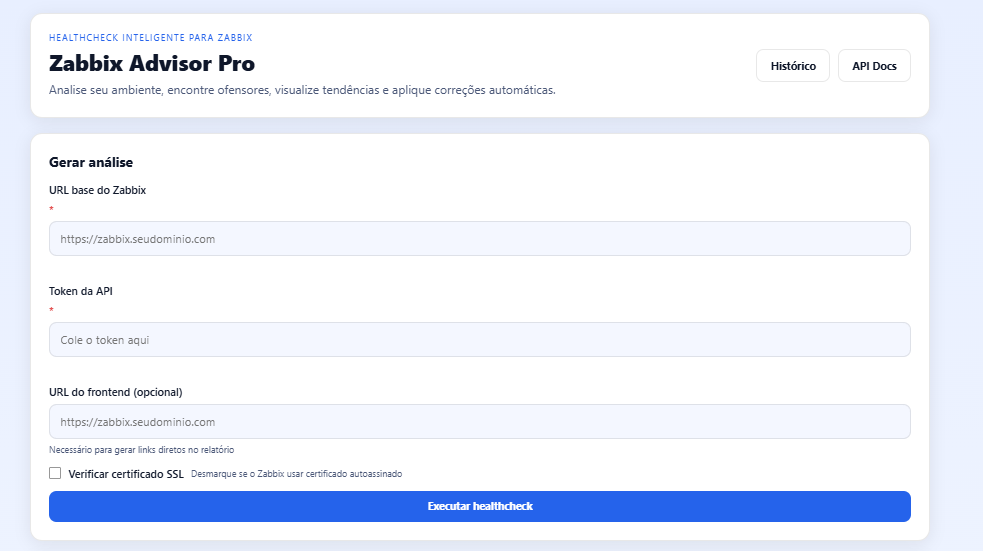
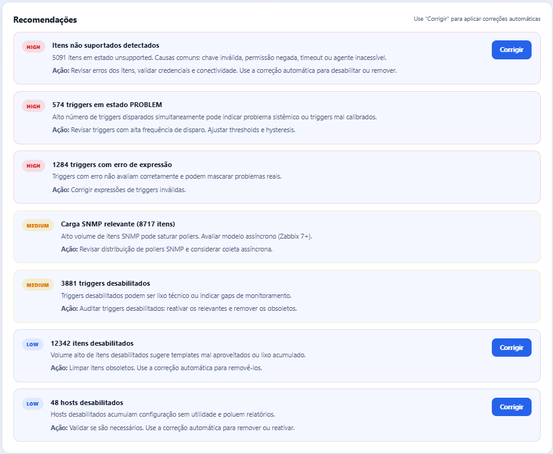
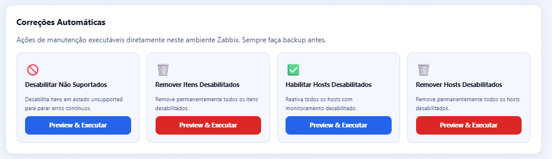
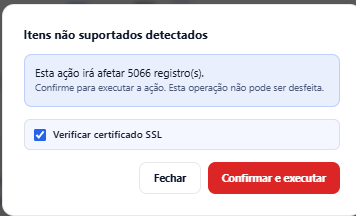
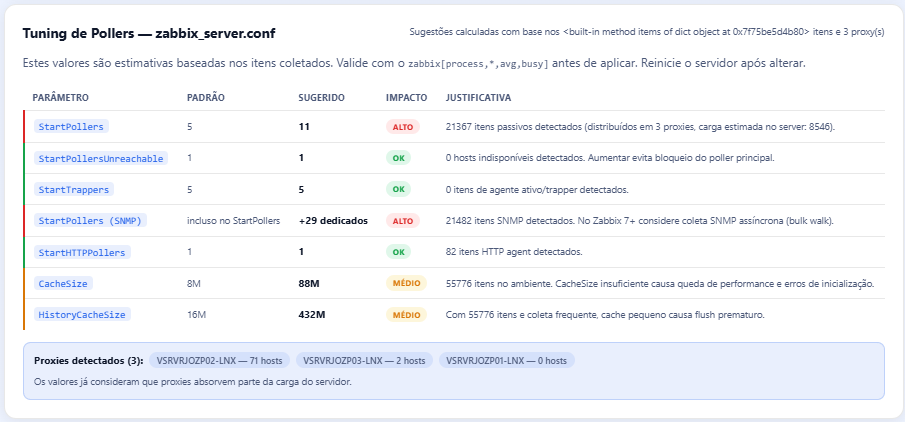
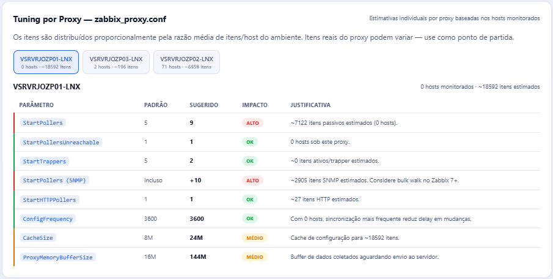

# Zabbix Advisor Pro

Ferramenta de healthcheck para ambientes Zabbix com dashboard web, recomendações priorizadas, correções automáticas, tuning de pollers e exportação de relatórios.

## Recursos

- **Dashboard web** com KPIs, top hosts/templates e recomendações priorizadas
- **Gráficos interativos** (Chart.js): distribuição de itens por tipo, hosts por proxy, triggers por severidade, tendência histórica
- **Detecção automática** de itens unsupported, itens desativados, hosts desativados, triggers sem ação
- **Correções automáticas** com preview/dry-run antes de aplicar:
  - Desativar itens unsupported
  - Deletar itens desativados
  - Deletar hosts desativados
  - Reativar hosts desativados
- **Tuning de pollers** — sugestões de parâmetros para `zabbix_server.conf` com base nos dados coletados
- **Tuning por proxy** — sugestões individuais de `zabbix_proxy.conf` para cada proxy detectado
- **Histórico de análises** em SQLite com comparação de tendências
- **Exportação** em PDF e CSV
- **Toggle SSL** — verificação de certificado desabilitada por padrão (configurável por análise e por ação de correção)
- **Rate limiting** via slowapi
- Integração com API JSON-RPC do Zabbix (compatível com Zabbix 6.x e 7.x)
- Docker e docker-compose

## Estrutura

```text
zabbix-advisor-pro/
├── app/
│   ├── api/
│   │   ├── corrections.py   # endpoints de correção automática
│   │   ├── history.py       # endpoints de histórico
│   │   └── routes.py        # analyze, export, debug
│   ├── analyzers/
│   │   └── environment_analyzer.py
│   ├── core/
│   │   ├── config.py
│   │   ├── database.py      # SQLite (snapshots)
│   │   ├── logger.py
│   │   └── zabbix_client.py
│   ├── schemas/
│   │   └── analysis.py
│   ├── services/
│   │   ├── correction_service.py
│   │   ├── export_service.py
│   │   └── health_service.py
│   └── main.py
├── static/
│   └── css/style.css
├── templates/
│   ├── index.html
│   ├── report.html
│   └── history.html
├── tests/
│   └── test_analyzer.py
├── data/                    # criado automaticamente (advisor.db)
├── Dockerfile
├── docker-compose.yml
├── requirements.txt
└── .env.example
```

## Como executar localmente

```bash
python -m venv .venv
source .venv/bin/activate   # Linux/macOS
# .venv\Scripts\activate    # Windows

pip install -r requirements.txt
cp .env.example .env
uvicorn app.main:app --reload
```

Acesse: `http://127.0.0.1:8000`

## Como executar com Docker

```bash
cp .env.example .env
docker compose up --build
```

O banco SQLite é persistido em `./data/advisor.db` via volume no docker-compose.

## Endpoints

### Interface web

| Rota | Descrição |
|------|-----------|
| `GET /` | Tela inicial |
| `POST /report` | Gera relatório HTML completo |
| `GET /history` | Histórico de análises |
| `GET /health` | Healthcheck da aplicação |

### API REST

| Método | Rota | Descrição |
|--------|------|-----------|
| `POST` | `/api/v1/analyze` | Healthcheck completo (retorna JSON + salva snapshot) |
| `GET` | `/api/v1/history` | Lista snapshots salvos |
| `GET` | `/api/v1/history/{id}` | Detalhes de um snapshot |
| `GET` | `/api/v1/history/{id}/trend` | Dados de tendência para o ambiente |
| `GET` | `/api/v1/corrections/actions` | Lista ações de correção disponíveis |
| `POST` | `/api/v1/corrections/preview` | Preview (dry-run) de uma ação de correção |
| `POST` | `/api/v1/corrections/execute` | Executa uma ação de correção |
| `POST` | `/api/v1/export/csv` | Exporta relatório em CSV |
| `POST` | `/api/v1/export/pdf` | Exporta relatório em PDF |
| `POST` | `/api/v1/debug/proxies` | Diagnóstico: retorna dados brutos de proxy.get |

## Campos do formulário

| Campo | Obrigatório | Descrição |
|-------|-------------|-----------|
| `url` | Sim | URL base do Zabbix, ex.: `https://zabbix.exemplo.com` |
| `token` | Sim | Token de API do Zabbix |
| `frontend_url` | Não | URL do frontend para gerar links diretos no relatório |
| `verify_ssl` | Não | Verificar certificado SSL (padrão: desabilitado) |

## Ações de correção automática

Todas as ações possuem **preview** antes de executar (dry-run mostrando o que será afetado).

| Ação | Descrição |
|------|-----------|
| `disable_unsupported` | Desativa itens com status "unsupported" |
| `delete_disabled_items` | Remove permanentemente itens desativados |
| `delete_disabled_hosts` | Remove permanentemente hosts desativados |
| `enable_disabled_hosts` | Reativa hosts desativados |




> **Atenção:** as ações `delete_*` são irreversíveis. Sempre revise o preview antes de confirmar.


## Tuning sugerido

O relatório inclui duas seções de tuning baseadas nos dados coletados:

### zabbix_server.conf

Sugestões de parâmetros como `StartPollers`, `StartPingers`, `StartDBSyncers`, `CacheSize`, etc., calculados com base no número de itens, hosts e tipo de coleta.

### zabbix_proxy.conf (por proxy)

Para cada proxy detectado, sugestões individuais considerando a proporção de hosts e itens monitorados por aquele proxy.

## Observações técnicas

- Compatível com Zabbix 6.x e 7.x (normalização automática de campos renomeados, ex.: `host` → `name`, `status` → `operating_mode` em proxies)
- Batch operations usam `item.update` e `host.update` com array — uma única chamada de API por ação
- O banco SQLite é criado automaticamente em `data/advisor.db` na primeira execução
- Migrações de schema são não-destrutivas (ALTER TABLE com fallback silencioso)
- Rate limiting: 30 requisições/minuto por IP para endpoints de análise

## Testes

```bash
pytest tests/ -v
```

15 testes cobrindo: totais, triggers, proxies, chart_data, recomendações, links de frontend e ambiente vazio.

## Referências

### Zabbix

- [Zabbix Documentation](https://www.zabbix.com/documentation/current/) — Documentação oficial do Zabbix
- [Zabbix API (JSON-RPC)](https://www.zabbix.com/documentation/current/en/manual/api) — Referência completa da API JSON-RPC utilizada para coleta de dados e correções
- [Zabbix Performance Tuning](https://www.zabbix.com/documentation/current/en/manual/appendix/performance_tuning) — Base para os cálculos de tuning de pollers e cache

### Backend

- [FastAPI](https://fastapi.tiangolo.com/) — Framework web assíncrono utilizado para a API REST e interface web
- [Uvicorn](https://www.uvicorn.org/) — Servidor ASGI utilizado para execução da aplicação
- [Pydantic](https://docs.pydantic.dev/) — Validação de dados e configuração via `BaseSettings`
- [Pydantic Settings](https://docs.pydantic.dev/latest/concepts/pydantic_settings/) — Gerenciamento de variáveis de ambiente
- [Jinja2](https://jinja.palletsprojects.com/) — Engine de templates para renderização do dashboard
- [Requests](https://requests.readthedocs.io/) — Cliente HTTP para chamadas à API do Zabbix
- [slowapi](https://slowapi.readthedocs.io/) — Rate limiting para endpoints da API

### Exportação

- [ReportLab](https://docs.reportlab.com/) — Geração de relatórios em PDF

### Frontend

- [Chart.js](https://www.chartjs.org/docs/) — Biblioteca de gráficos interativos (donut, bar, pie)
- [Bootstrap](https://getbootstrap.com/docs/) — Framework CSS para o layout do dashboard

### Banco de dados

- [SQLite](https://www.sqlite.org/docs.html) — Banco de dados local para armazenamento de snapshots e histórico de análises

### Infraestrutura

- [Docker](https://docs.docker.com/) — Containerização da aplicação
- [Docker Compose](https://docs.docker.com/compose/) — Orquestração local dos serviços

### Testes unitários

- [pytest](https://docs.pytest.org/) — Framework de testes utilizado na suíte de testes unitários
